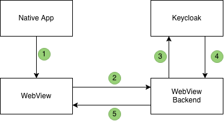

--- 
draft: false
title: "The Problem Nobody Has Named Yet: Native-to-Web SSO"
description: "Native apps and web apps use incompatible session mechanisms. Here is how to bridge them with OAuth 2.0 Token Exchange."
tags: ["oauth2", "security", "mobile", "keycloak"]
ai_assisted: true
---

There is a gap in the OAuth 2.0 ecosystem that almost every team with a native mobile app eventually falls into. It does not have a widely agreed-upon name. It is not covered by any RFC. And yet, once you hit it, you quickly realize that everyone else has hit it too, and solved it differently.

The problem: your native app has a perfectly valid session. The user is logged in. Now you want to open a piece of web content (a WebView, an in-app browser tab) and have the user land there already authenticated. No second login screen. No friction.

It sounds trivial. It is not.

## Why It Breaks

OAuth 2.0 and OIDC draw a hard line between native and web contexts, and for good reason. Native apps store session state as tokens (access tokens, refresh tokens) tucked away in secure platform storage. Web apps authenticate via browser cookies. A Keycloak session, for example, lives in a `KEYCLOAK_SESSION` cookie in the system browser's cookie jar.

These two mechanisms are intentionally isolated from one another. An embedded WebView has its own cookie store, separate from the system browser and inaccessible to the native app's token storage. When your WebView performs a normal `/authorize` redirect, Keycloak sees a fresh, unauthenticated browser session. The user gets a login screen.


[RFC 8252: OAuth 2.0 for Native Apps](https://www.rfc-editor.org/rfc/rfc8252) actually anticipated this. It explicitly recommends against embedded WebViews for authorization flows, precisely because they break cookie-based SSO. The spec-compliant answer is to use the system browser (Android Custom Tabs, iOS ASWebAuthenticationSession), where the existing Keycloak session cookie is already present.

That works. Sometimes. But it comes with two real-world problems that make it an incomplete answer:

1. Switching from the native app context to the system browser is often a product-level non-starter. The UX break is jarring, especially for in-app features that happen to be web-based.
2. System browser sessions expire. If the user has not touched the system browser in a while, the Keycloak session cookie is gone, and the seamless handoff breaks anyway.

[RFC 9700: OAuth 2.0 Security Best Current Practice](https://www.rfc-editor.org/rfc/rfc9700) reinforces the system browser recommendation and warns against patterns that expose tokens to untrusted environments, which a WebView, from the spec's perspective, is.

So you end up in what one engineer on our team described as the "chaotic area of the Cynefin framework": no best practice applies cleanly, and you are writing custom infrastructure.

## What the Industry Does

We spent time researching how other organizations handle this, and the findings were clarifying, if not comforting: there is no standard, but there is a clear pattern.

**REWE** seems to have a dedicated WebView endpoint. When their native app wants to open a WebView, it calls this endpoint with its access token. The service behind the endpoint validates the token and issues a service-scoped session cookie, then redirects the WebView to the target URL. The user arrives authenticated.

**Spotify** took a slightly different angle. Their app generates a One-Time Token (OTT) and injects it into the target URL when opening a WebView. On page load, the OTT is redeemed server-side, a web session is created, and the user is authenticated. Short-lived, single-use, no persistent token exposure.

**Auth0** recognized the pattern too. They released a [Native-to-Web SSO](https://auth0.com/docs/authenticate/single-sign-on/native-to-web) feature in 2024 (the only true off-the-shelf solution we found). It is proprietary and tied to their platform, but its existence signals that the industry is starting to acknowledge this as a real, named problem worth solving at the product level.

**Connect2id** follows a similar pattern as Auth0 with a [web session bootstrap endpoint](https://connect2id.com/products/server/docs/guides/web-session-bootstrap-for-native-apps).

All three approaches, despite their differences, have the same underlying shape:

1. The native app already holds a valid access token.
2. It calls a backend endpoint to initiate the handoff.
3. The backend returns a short-lived, single-use token or session handle.
4. The app opens the WebView with that value.
5. The backend redeems it, creates the web session, and sets the cookie.
6. The user arrives authenticated.

The variation is in who issues the bridge token and what the resulting session is scoped to. But the architecture is the same everywhere.

## Our Approach: Token Exchange

After evaluating the options, we settled on [OAuth 2.0 Token Exchange (RFC 8693)](https://www.rfc-editor.org/rfc/rfc8693) as our recommended approach. The key constraint we set for ourselves was to avoid introducing custom Keycloak providers or bespoke token minting infrastructure. The solution had to work with what Keycloak already ships.

Token Exchange fits that constraint. It is a standard grant type that Keycloak supports natively, no extensions or custom code required. The native app passes its existing access token to the target web application's backend. That backend calls Keycloak's token exchange endpoint, which validates the token and returns a new one scoped to the target client. The web app uses that token to create a session and set a cookie. The user arrives authenticated.



1. The native app opens the WebView and passes its access token to the target web app.
2. The target web app backend receives the token.
3. The backend calls Keycloak's token endpoint:

   ```text
   POST /realms/{realm}/protocol/openid-connect/token
   grant_type=urn:ietf:params:oauth:grant-type:token-exchange
   &subject_token=<access_token>
   &subject_token_type=urn:ietf:params:oauth:token-type:access_token
   &requested_token_type=urn:ietf:params:oauth:token-type:access_token
   &client_id=<target_client_id>
   &client_secret=<target_client_secret>
   ```

4. Keycloak returns a token scoped to the target client.
5. The web app creates a server-side session and sets its session cookie.
6. The user is redirected to the target page already authenticated.

The setup on the Keycloak side is purely configuration: enabling token exchange for the relevant clients and defining which clients are permitted to exchange tokens on behalf of which others. No custom provider code, no additional services, nothing outside of what the Keycloak admin console exposes.

The one thing that remains the application's responsibility is the session bootstrap endpoint. Token exchange produces a token; turning that into a session is something only the web app can do. That is a small, well-defined integration point, and it is unavoidable regardless of which approach you take.

Worth noting: as of [Keycloak 26.2](https://www.keycloak.org/2025/05/standard-token-exchange-kc-26-2), Standard Token Exchange is officially supported and fully compliant with RFC 8693; it is no longer a preview feature. If you are on an older version, refer to the [legacy token exchange documentation](https://www.keycloak.org/securing-apps/token-exchange) and be aware that configuration differs slightly, particularly around [fine-grained admin permissions](https://www.keycloak.org/docs/latest/authorization_services/#_resource_server_overview) which must be enabled separately.

One operational caveat: logout does not propagate automatically. If the user logs out in the native app, the web session created via token exchange will persist until it expires or until you implement explicit [backchannel logout](https://www.keycloak.org/docs/latest/securing_apps/#_backchannel_logout) handling.

Token exchange works, but it is still a workaround. What the ecosystem is actually missing is a dedicated, IdP-supported mechanism for this flow — something like Auth0's Session Transfer Token, designed from the ground up for secure one-time session handoffs: short-lived, single-use, and without exposing long-lived credentials to the WebView. I have opened [an issue on the Keycloak tracker](https://github.com/keycloak/keycloak/issues/46660) requesting exactly that. If this problem affects your team, an upvote there helps signal demand.

## A Note on Embedded Third-Party Apps

One temptation worth flagging: embedding entire third-party web applications in a native WebView and handling authentication at the frame level. This pattern, though common, creates tight coupling between the native app and the web app's session model, complicates logout, and makes it harder to reason about security boundaries.

Where possible, prefer a Backend for Frontend (BFF) pattern, where the native app's backend mediates access to third-party services rather than loading them directly in a WebView. Token exchange into an embedded WebView should be a pragmatic last resort, not a first architectural choice.

## Where This Leaves Us

The Native-to-Web SSO handoff problem is real, underspecified, and widely encountered. The specs tell you what not to do (embedded WebViews, direct token injection), but stop short of prescribing a solution for the cases where the spec-compliant path (the system browser) is not viable.

Until the ecosystem catches up with a proper standard, the practical answer is some variation of the OTT/session-bootstrap pattern. Token exchange via [RFC 8693](https://www.rfc-editor.org/rfc/rfc8693) is the most principled version of this pattern currently available. It is not perfect, but it is grounded in a real specification, keeps the trust logic in the identity provider, and avoids the most fragile parts of the custom approaches we saw in the wild.

If you are dealing with this problem, you are in good company. And now, at least, you have a name for it.

## References

- [RFC 8252: OAuth 2.0 for Native Apps](https://www.rfc-editor.org/rfc/rfc8252)
- [RFC 8693: OAuth 2.0 Token Exchange](https://www.rfc-editor.org/rfc/rfc8693)
- [RFC 9700: OAuth 2.0 Security Best Current Practice](https://www.rfc-editor.org/rfc/rfc9700)
- [Auth0 Native-to-Web SSO](https://auth0.com/docs/authenticate/single-sign-on/native-to-web)
- [Keycloak: Configuring and Using Token Exchange](https://www.keycloak.org/securing-apps/token-exchange)
- [Keycloak 26.2: Standard Token Exchange now officially supported](https://www.keycloak.org/2025/05/standard-token-exchange-kc-26-2)
- [Keycloak: Backchannel Logout](https://www.keycloak.org/docs/latest/securing_apps/#_backchannel_logout)
- [Keycloak: Feature Request "Native-to-Web SSO / Session Transfer for Embedded WebViews" ](https://github.com/keycloak/keycloak/issues/46660)
